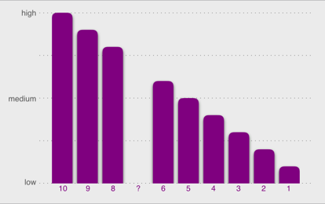
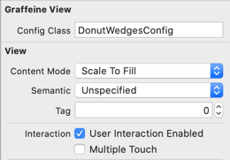
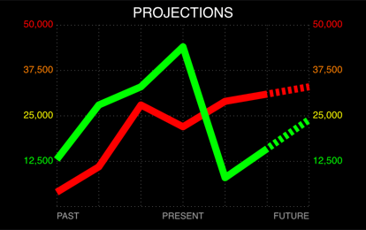
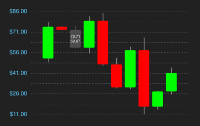
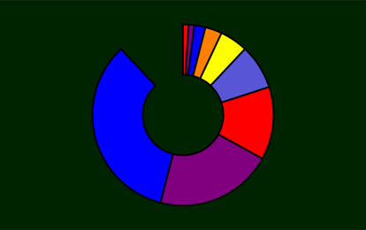
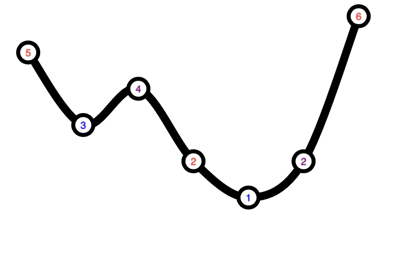
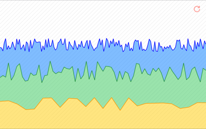
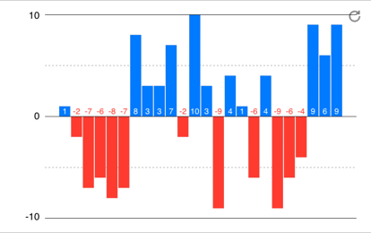
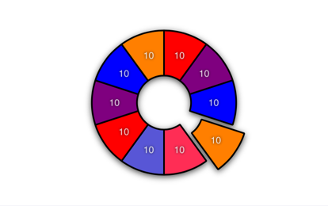

#  Graffeine


[](https://travis-ci.com/quickthyme/graffeine)


**Graffeine** /gra•**feen**/ - *n* - Simple, modular graphs for iOS.

## Introduction



**It's like, graphing... with caffeine.**

Graffeine is an iOS library that uses CoreAnimation to render various types of data
graphs and charts. It is dynamically style-able, reasonably extendable, featuring
a declarative interface, modular layers, configuration binding, and auto-layout.
**Supports both UIKit and SwiftUI.**


## Pieces and Parts


### GraffeineView

Subclass of UIView that manages and provides the rendering context for the various
graphing layers, which are divided into 5 *regions*:

               Top Gutter
            +---------------+
    Left    |     Main      | Right
    Gutter  |     Region    | Gutter
            +---------------+
              Bottom Gutter


Whenever a layer exists belonging to one of the regions, its positioning and size will
automatically be managed by the view, which includes responding to layout changes or
resizing events.

By default, `GraffeineView` contains no layers. We must add layers to it by setting
the `layers` property, like so:

```swift
    graffeineView.layers = [
        GraffeineHorizontalLabelLayer(id: "top", 
                                      height: 16,
                                      region: .topGutter),
        
        GraffeineHorizontalLabelLayer(id: "bottom",
                                      height: 26,
                                      region: .bottomGutter),
        
        GraffeineBarLayer(id: "bars")
            .apply ({
                $0.unitColumn.margin = 5
                $0.colors = [.blue, .orange]
            })
    ]    
```

##### Configuration Class



GraffeineView allows automatic binding to a configuration class, as a convenient
means for encapsulating all of the setup and styling for our graphs. We provide
the name of our `configClass` during init, or by binding within InterfaceBuilder
as shown here.

The base config class itself is an NSObject subclass containing nothing more than an
empty initializer. Just override this in a custom config subclass, and
then design the view however. This is where we'll generally want to construct
our layers, like in the example above.

Using the config file is completely optional, but it is there as a convenience
to help us extract our infrastructure and styling code away from the more
interesting use-cases and the models driving them. This is also why data animations
now use semantics rather than just "keys", so that we can invoke them with
meaningful intent based on current context. *(See Interaction)*


### GraffeineLayer 

*(abstract)* Container-like "graphing layer" used to represent a particular graph
component. By combining layers, we can dial in exactly the layout we want and
render amazing graphs.

Out of the box, there are a handful of ready-to-go layers:

| Drawing Layers                   | Displays                        |
|----------------------------------|---------------------------------|
| `GraffeineBarLayer`              |   vertical or horizontal bars   |
| `GraffeineGridLineLayer`         |   horizontal or vertical lines  |
| `GraffeineLineLayer`             |   bezier line connecting data   |
| `GraffeineRadialLineLayer`       |   lines outward from center     |
| `GraffeineRadialPolyLayer`       |   polygon arranged circularly   |
| `GraffeineRadialSegmentLayer`    |   segmented pies and donuts     |
| `GraffeinePlotLayer`             |   individual plots (points)     |
| `GraffeineHorizontalLabelLayer`  |   labels arranged horizontally  |
| `GraffeineVerticalLabelLayer`    |   labels arranged vertically    |
| `GraffeineBarLabelLayer`         |   labels arranged like bars     |
| `GraffeineRadialLabelLayer`      |   labels arranged circularly    |
| `GraffeinePlotLabelLayer`        |   labels arranged linearly      |


#### Constructing

When constructing a `GraffeineLayer`, we typically provide it with an `id` and
a `region`.

**id** is used to identify and access the layer after it has been added to a
`GraffeineView`:

```swift
    let pieLayer = graffeineView.layer(id: "pie")
```

**region** is the target area of the view to place the layer *(see GraffeineView)*

Any layer may be used with any region. While some are intended to be used with
certain regions, we're free to arrange them however we like.


#### Dimensional Unit

Certain properties, such as `unitWidth` or `diameter`, are defined as a
`DimensionalUnit`. This is an abstract unit type *(enum)*, that affects sizing
and positioning depending on which we specify:

 `.explicit( val )`   - literal number of pixels/points *(22.0 == 22px)*
 
 `.percentage( val )` - ratio size:container; fractional *(1.0 == 100%)*
 
 `.relative`          - automatic sizing based on the number
                        of units sharing the same container


### Value Labels

Out-of-the-box, there are several label options: horizontal, vertical, bar,
plot, and radial. All labels support vertical/horizontal alignment and padding.


##### Gutter Labels



Both `GraffeineHorizontalLabelLayer` and `GraffeineVerticalLabelLayer` are designed to
be used in the gutter region, where they can be configured to align with the units
displayed in the main region. This is important for things like bar and line charts,
where the labels need to line up exactly with the grid.

When using the horizontal or vertical label layers, we can choose how their unit
alignment gets distributed. Their horizontal/vertical label alignment properties
are relative to the unit, or column-width in which they are bound. So setting a label
to be `.center` means it will center itself **to the column**. Setting
`.centerLeftRight` will cause the first and last labels to be left/right aligned,
but all other labels will be centered.


##### Bar Labels



The `GraffeineBarLabelLayer` is primarily designed to be used in conjunction with
bar graphs.


##### Radial Labels



The `GraffeineRadialLabelLayer` is primarily designed to be used in conjunction with
pie and donut charts.


##### Plot Labels



The `GraffeinePlotLabelLayer` is primarily designed to be used in conjunction with
line and plot graphs.


## Interaction

### GraffeineData



The `GraffeineData` structure is the vehicle used to feed data into Graffeine.

The same data structure is used to drive all of the layer types. For the most part,
it should be reasonably self-evident, however, there are a few caveats to this,
as each layer *interprets* the data differently. Therefore, it is somewhat important
to understand a little bit about how certain properties can affect rendering:

  - `valueMax`, when provided, will be used as the maximum range for the
  given values. Otherwise, the layer will automatically *guess* the max
  based on its display characteristics. When providing this value, it is
  completely up to the developer to ensure that the value is "legal".
  
  - `values.hi` is the primary stream of input data. If/when troubleshooting, we
  should make sure that this is the field containing the values we expect to see.
  
  - `values.lo` is an additional, optional stream of values that are generally
  used to alter how the nominal hi-values get rendered. This behavior largely
  depends upon the particular layer's characteristics. For example, bar
  and line layers can use this as a lower boundary, whereas a pie chart ignores
  it altogether. Also, see the **section below regarding negative values.**

  - `labels` is what label layers look for when rendering text values.
  
  - `selected.index`, if set, is the value index of the current selection.
  
  - `selected.labels`, if provided, will override the regular label for the
  given index


##### Displaying the data

It is easy to apply new data to a specific layer by **assignment**:

```swift
    graffeineView.layer(id: "bar")?.data = GraffeineData(values: [1, 2, 3])
```
                                             
Or if we want it to **animate** whenever the data changes:

```swift
    graffeineView.layer(id: "pie")?.unitAnimation.data.add(
        GraffeineAnimation.Data.RadialSegment
            .Spin(duration: 1.2, timing: .easeInEaseOut), for: .reload)
    
    graffeineView.layer(id: "pie")?.setData(GraffeineData(values: [1, 2, 3]),
                                            semantic: .reload)
```

  ☝️ *There are a handful of data animators included with the library, out-of-box,
  or we can create our own custom, so long as it conforms to one of the
  `GraffeineDataAnimating` protocols.*


##### Data Binding

As an alternative to setting data on the layers manually, we can apply data to
many layers at once by assigning a special array to GraffeineView's `layerDataInput`
field. This is a *write-only* field that is primarily intended for use with SwiftUI
`@State` bindings, but is perfectly fine to utilize in UIKit driven scenes as well.


#### Negative Values and Transposing



When it comes to rendering data as graphical illustrations, handling negative
values immediately creates problems for the developer. This is less about
calculation, and more about intuition. Depending on what it is the graph
is supposed to communicate, one's expectations of how negative values should
be portrayed can vary.

  - **Radial Layers** do not understand negative values and will likely give
undesirable results.

  - **Line and Plot Layers** can accept negative values, but their display is
  essentially rooted to the bottom-left (0,0) axis. If we need to show
  negative values within the visible bounds, then we must transpose the data
  ourselves before feeding it to Graffeine.

  - **Bar Layers**, upon detection of negative values in the data, will try to
  automatically transpose it so that "zero" becomes centered vertically
  (or horizontally if using `.flipXY`.)

  **IMPORTANT:** The automatic transposing used by the bar layers will override
  any values stored in `values.lo`! Therefore, we cannot rely on this for things
  like segmented bars or candlestick charts. In this situation, we must transpose
  the data beforehand.


### User Selection



Selection is divided into two parts, that of receiving user interaction, and that
of rendering the selection state.

#### Receiving touch events
All selection events are raised through `GraffeineView` via the `onSelect` handler.
By assigning a handler to this, you will start receiving events whenever the user
taps on the view.

In order to receive more granular events, you first need to tell it which layer(s)
you want to receive touch events for. Do this by setting the layer's
`selection.isEnabled` property to `true`:

```swift
    graffeineView.layer(id: "bars")?.selection.isEnabled = true
```

**This only affects whether or not the layer will respond to user touch.**

When enabled, the `onSelect` handler may include `SelectionResults`.

If either the `SelectionResult` or its `data.selected.index` is nil, we
can interpret it as "deselection". Otherwise, we should have all the
information we need in order to handle the event:
 
 - `point` is the view coordinate of the item that was selected, (in the
 coordinate-space of the `GraffeineView`). This is useful in case you wish to
 present some kind of pop-up UI and would like to attach any stems or other
 such elements to this point.

 - `data` is the layer's original data, updated to reflect the new selection state

 - `layer` is a reference to the GraffeineLayer that contains the selected item.
 Graffeine does NOT automatically update its state in response to a selection event.
 This is by design. If you just want to immediately display selection whenever the
 user taps on something, you can do that in the `onSelect` handler like so:

```swift
graffeineView.onSelect = { view, selection in
    view.select(index: selection?.data.selected.index, semantic: .select)
}
```

**Alternatively**, if you only want to update the *selected* layer:

```swift
graffeineView.onSelect = { view, selection in
    selection?.layer.setData(selection!.data, semantic: .select)
}
```


#### Rendering the selection

In order to render the selection changes, you need to first enable some overrides:

```swift
graffeineView.layer(id: "bars")?.selection.fill.color = .green
graffeineView.layer(id: "bars")?.selection.line.color = .black
graffeineView.layer(id: "bars")?.selection.line.thickness = 3.0
graffeineView.layer(id: "labels")?.selection.text.color = .label
```

Then, just include the `selectedIndex` whenever you set the data. Make sure to
include any layers that need to respond to the selection change.


### SwiftUI

**GraffeineView** is a natural fit for SwiftUI. Add it to any view hierarchy
using the provided `GraffeineViewRep`:

```swift
struct ContentView: View {

    @State var dataInput: [GraffeineView.LayerData] = []

    var body: some View {
        GraffeineViewRep(
            configClass: "VerticalDescendingBarsConfig",
            layerDataInput: $dataInput,
            onSelect:({ view, selection in
                view.select(index: selection?.data.selected.index,
                            semantic: .select)
            }))
    }
}
```


### Dynamic Colors and Dark Mode

Graffeine conveniently supports dynamic `UIColor` objects, including those
created with dynamic appearance traits. Whenever the user switches between
normal and dark display modes, then all of the `fill`, `line`, and `text`
colors are automatically reapplied with their updated characteristics.


### Demo App

There is an iOS app,
*[graffeine-demo](https://github.com/quickthyme/graffeine-demo)*,
which demonstrates how to quickly go about composing many typical types of graphs. If
nothing else, it serves as an example of how to plug the library in and turn it on.

